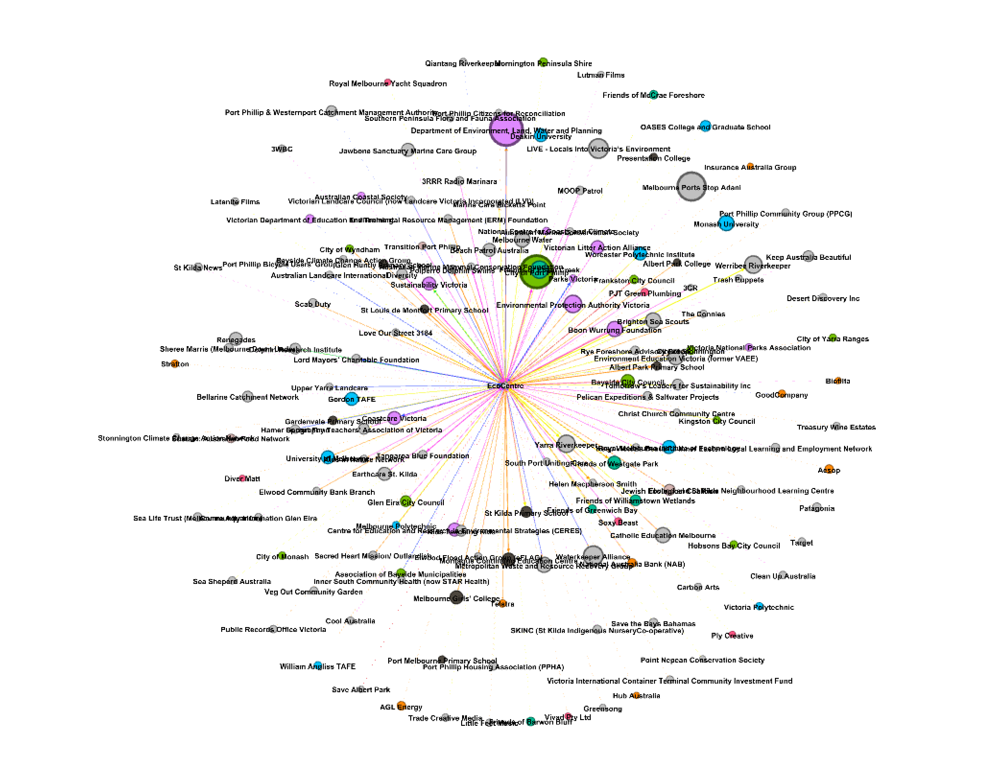
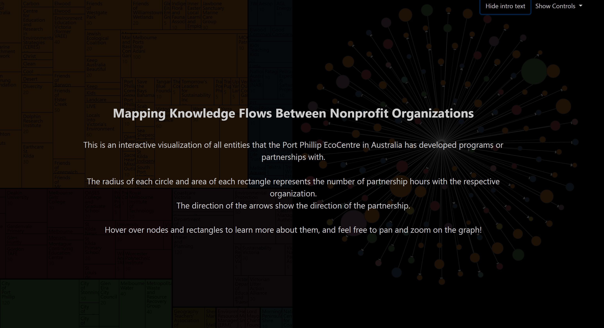
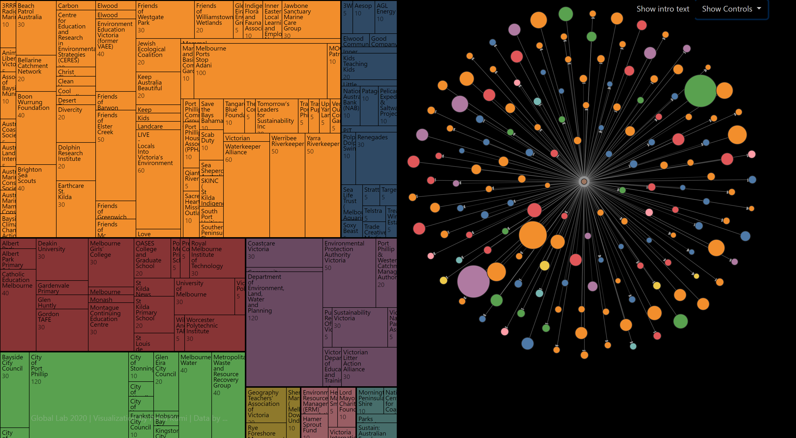
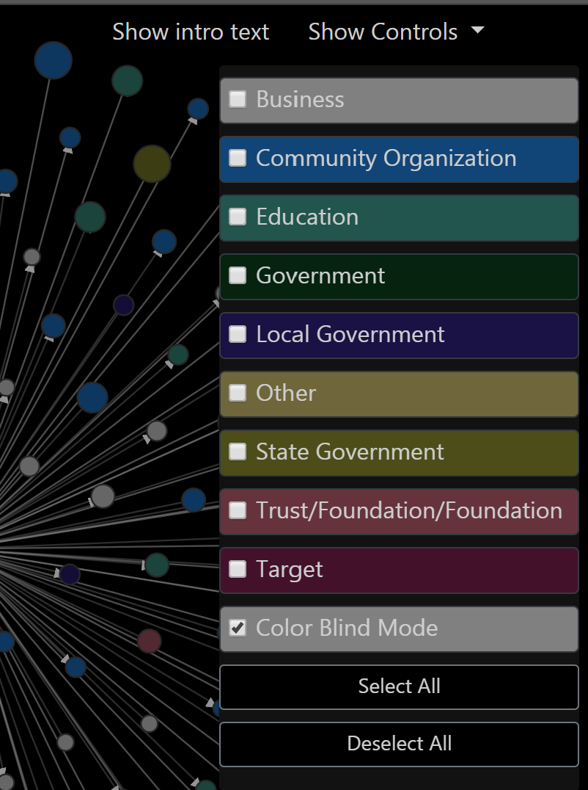

Assignment 4 - DataVis Remix!
===

The primary aim of this assignment is to showcase your **individual** skills at critiquing and creating interactive visualizations on the web.

### Original Visualization

This visualization was done by an IQP team that went to Australia last D term. I was able to contact the advisors and
retrieve the data they collected so I could redo their viz. 

The visualization shows various organizations that the Port Philip EcoCentre in Australia has partnerships with. The bigger
node radius shows more hours of partnership, and the arrow shows the direction of the partnership. The color shows the type of organization:
Business, Community Organization, Education, Government, Local Government, Other, State Government, Trust/Foundation/Foundation, Target

Problems with the original viz:
- Users are only able to interact with the viz through an app called Gephi, but even then the controls are really hard to use and make for a bad user experience.
- The colors pop too much and become distracting
- The node names overlap each other making it very hard to understand what is going on in the graph

My redesign:
- Recreate the force graph with d3, removing the names
- Create a better color scheme
- Users are able to hover over the nodes to get more information about it
- Users are able to hover over a node and see all the other nodes of the same group
- Put the force graph side by side with a tree map so users can better understand which organizations have the largest partnerships
- Add a legend/controls so users can choose to select or deselect groups of nodes more easily and understand what group a color belongs to
- Make the force graph movable and zoomable
- Add a colorblind mode that changes the color scheme to a more colorblind friendly one

## Technical Achievements
- Controls dropdown button that also serves as a legend
- Allowing users to select or deselect all groups with one button
- Allowing users to select more than one group at a time using the dropdown menu
- Option to show or hide the introductory text
- Hovering over one section of the treemap or the force graph will highlight elemetns of that same group on the other visualization
- Hovering over a node or section of the treemap gives you more information about that node
- The force graph is zoomable, can be panned, and moved around to allow the user to explore the data as much as they want. 

## Design achievement
- A far more appealing color scheme with color blind mode
- Adding colors to the dropdown list menu to make it easier for the user to understand which color corresponds to which category
- When hovering over nodes, the change of color happens as a transition to allow for a smoother interaction with the interface
- Intro text is put behind a  dark background to increase visibility
- Added number of hours to treemap graph to give users a sense of scale of partnership for each tree node. 
- The legend/controls can show or hide to leave as much space possible for the actual viz

##Images
### Original Viz

### New Viz
#### Front Text

#### Front Page

#### Controls

